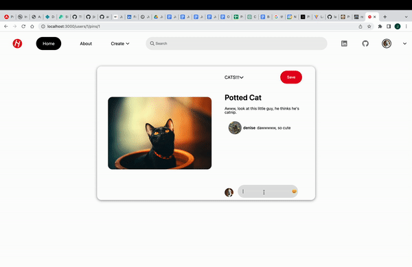

# Hobbypin


## Background

[Hobbypin](https://hobbypin.onrender.com/) is a [Pinterest](https://www.pinterest.com/) clone. Pinterest is website for idea visualization that allows the user to group different pictures with descriptions (called "pins") within "boards". These "boards" serve as a place to keep all of these "pins" together so they can be viewed any user. Hobbypin is also a place for keeping what inspires you organized and in one place.

## Technologies

* Javascript
* React
* Redux
* Ruby
* Ruby Rails
* PostgreSQL
* AWS S3
* Webpack
* Render

## 2 FEATURES

### Splash page animations and snapping


### Pin Comments


### Board updating and deleting


## CODE SNIPPET MARKDOWN

### Splash page keyframe animations
```css
@keyframes slide-in-header {
    0% {
        transform: translateY(20%);
    }
    100% {
        transform: translateY(-0%);
        opacity: 1;
    }
}

@keyframes slide-out-header {
    0% {
        transform: translateY(0%);
    }
    100% {
        transform: translateY(-20%);
        opacity: 0;
    }
}

.foodHeader {
    color: orchid;
    animation: 1s ease-out .3s 1 forwards slide-in-header, 1s ease-out 5s 1 forwards slide-out-header;
    opacity: 0;
}

.travelHeader {
    color: orangered;
    animation: 1s ease-out .3s 1 forwards slide-in-header, 1s ease-out 5s 1 forwards slide-out-header;
    opacity: 0;
}
```
